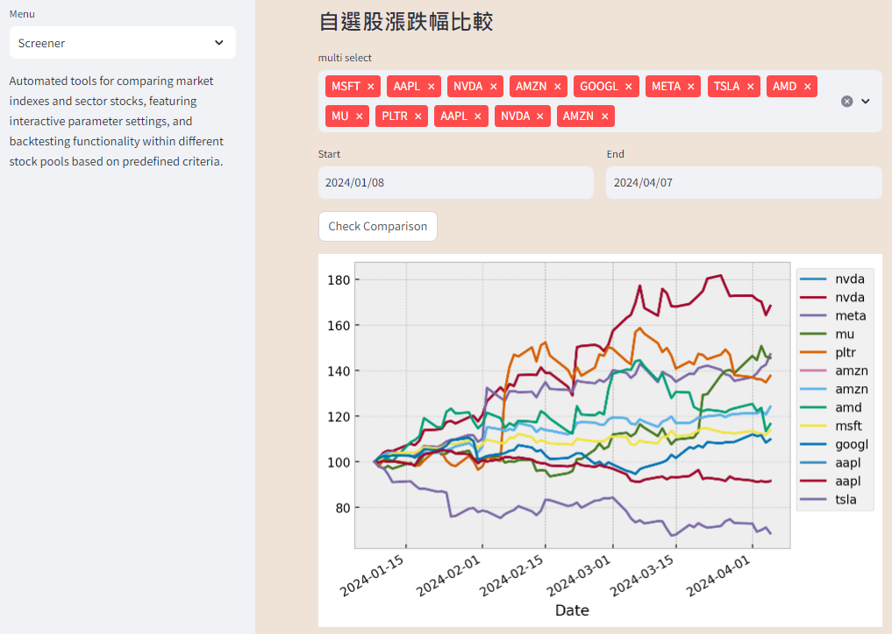

Automated tools for comparing market indexes and sector stocks, featuring interactive parameter settings, and backtesting functionality within different stock pools based on predefined criteria

### SideBar Pages
`Home`: Curate insightful media sources to articulate market perspectives, fostering a nuanced understanding of financial landscapes. Delivering astute analysis, this feature facilitates informed decision-making within a dynamic market environment.

`Screener`: Conduct comprehensive stock price growth analysis across diverse markets and sectors, with added support for customizable ticker comparisons. Embrace discretionary tickers for enhanced flexibility and insight into market trends.

`Backtest`: Filtering target stocks from a predefined pool based on multiple criteria, then employing algorithmic principles to plot entry and exit points for each target stock. Additionally, it compiles trade data such as entry, exit, and returns into a tabular format for user insights.

